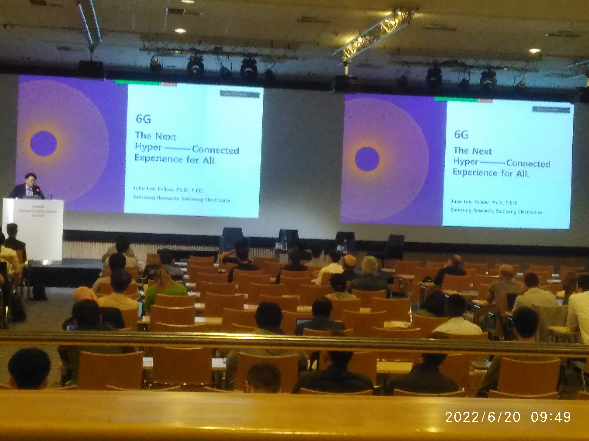
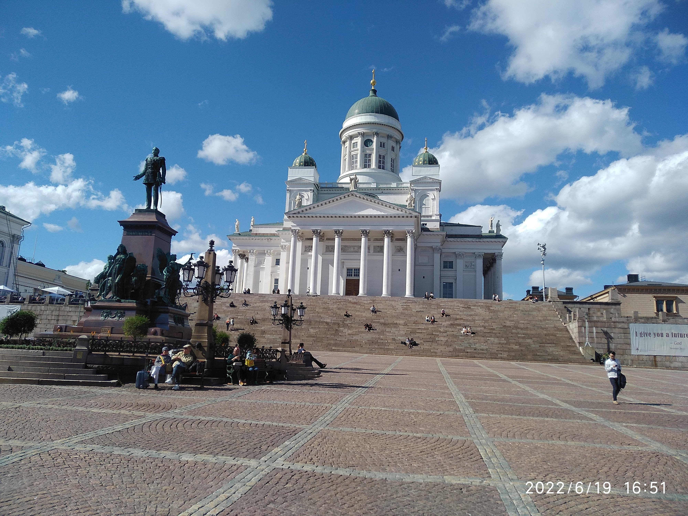

I recently had the opportunity to attend and present a joint work of my colleagues Sarvendranath, Unnikrishnan, myself and my supervisor Prof. Erik G. Larsson at the VTC2022 conference held in Helsinki, Finland. It was such a refreshing experience to attend in-person conference after a long time. Having attended three modes of conferences: in-person, virtual and hybrid, in-person is always a fulfiling experience, especially the chance to meet fellow researchers and expand your network.

VTC, an acronym for Vehicular Technology Society, is one of the flagship conferences covering a broader range of research domains from communications and signal processing to vehicular technology. VTC2022 had engaging technical sessions, including but not limited to tutorials, e.g., recently buzzing OTFS modulation, industrial keynotes and panel discussions from Nokia Bell Labs, Samsung research and Huawei research.

I have also honoured to first-time chair a technical session called "emerging systems", which included many engaging presentations. It was a unique experience ranging from the opportunity to know many fellow researchers and develop the skill to understand others' research work and initiate discussions with presenters.

I attended many engaging sessions and got to see different fascinating research directions other researchers across the globe are taking forward, to mention a few: a tutorial on OTFS by the authors of the book "Delay-Doppler Communications: Principles and Applications", a panel discussion on Enabling Technologies for Terahertz Communications, Keynotes: A Glimpse at 6G by Hannu Kauppinen, CTO, Nokia Technologies, 6G – The Next Hyper-Connected Experience for All by Juho Lee, Samsung, Building the Mega Constellation Satellite Network: 6G-NTN by Wen Tong, CTO, Huawei Wireless and also a panel discussion on world view on 6G by industrial experts. Apart from these, one exciting aspect of the conference was that technical sessions were narrowed down to specific research directions, making it easy to decide and attend those sessions. There were many technical paper sessions on the latest research developments in MIMO, RIS, Radio Access, Satellite Communications, Green Communications, Autonomous Vehicles, Security, THz Systems, Sensing, Machine Learning and many more. I will write a separate technical article on the industrial view on 6G presented at the conference soon.

I made many contacts at the conference and met a few researchers whom I met in my previous conference travels. Overall it was a lovely experience to attend the conference in person after a long pandemic which has affected almost everyone around the globe. 

Attending the conference also allows visiting and exploring new places. It was an enthralling experience roaming around in the city of Helsinki, the hosting city of the VTC2022 conference. It gave the impression that the city blends the architectural influence of Europe and Russia. Cobblestone streets run through the neoclassical city centre, where you will find boulevards with many beautiful parks. Moreover, with the beautiful harbour, coupled with ferry travels, supplements the city's beauty, attracting many tourists throughout the globe. I visited Helsinki Cathedral, Suomenlinna Sea Fortress, Temppeliaukio Church, Allas Sea Pool, Helsinki Central Library, and other city attractions. I hope to revisit the city in future.

