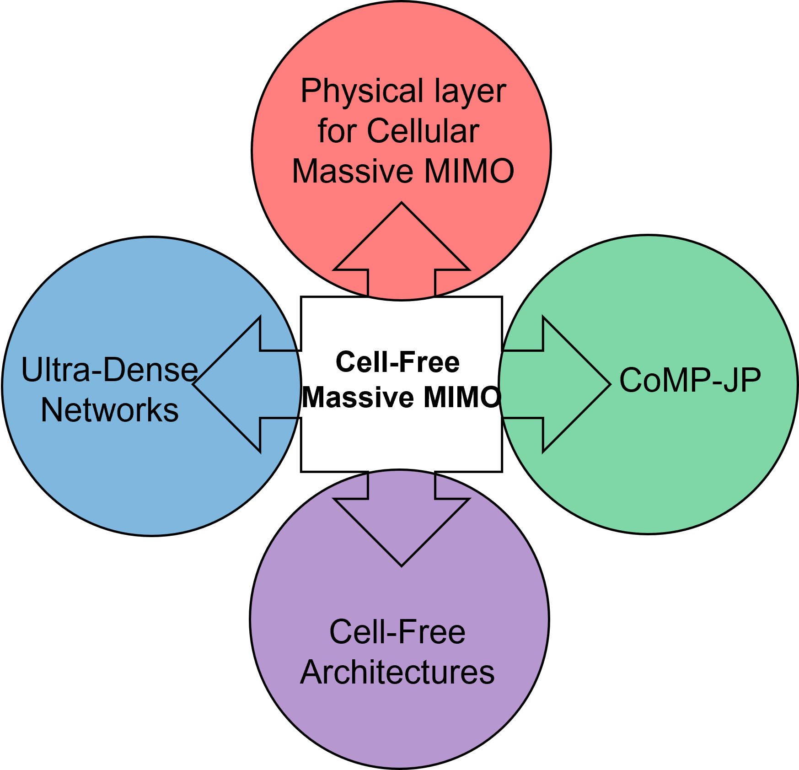

To understand cell-free massive MIMO conceptually, let’s begin with cellular networks. Many of us heard about cellular networks, and the term “cellular” stems from the fact that any telecom base station tower serves all the users in a given large geographical area, typically called a “cell”. 

Although current cellular networks offer good coverage (data rates) in the cell centre (close to the base station tower), they suffer from significant data rate variations within and at the cell edges  (far away from the base station tower). These non-uniform data rates make cellular services less reliable given the enormous data demands which continue to grow. Moreover, more and more wireless applications are popping up more or less every day, which demands the need to provide uniform quality of service in terms of data rate in the geographical coverage area. Towards this goal, attempts were made to decrease the cell-coverage area and deploy more base stations per area unit. The network capacity increases with the number of APs, but this trend gradually decreases and actually can reduce the capacity (highest achievable data rate) due to the increasing inter-cell interference (interference from neighbouring cells using same time-frequency resources). Thus, further densification of the networks is not the solution for the long-term sustainability of wireless networks with current demands. There is a need for a paradigm shift in how wireless networks operate, changing from traditional “cellular” networks to “cell-free” networks.

Thus, paving the way for cooperative operation of all the base stations and jointly serving the users in the area by effectively mitigating the interference and increasing the system throughput. Towards this, Cell-Free Massive MIMO is envisaged as a potential technology beyond 5G and 6G.

In the research literature, a base station is commonly referred to as an access point (AP). One reason for doing so is to avoid the notion that a base station refers to a massive tower with large antennas because with rapidly developing VLSI technology, antennas are getting smaller and smaller like those in a smartphone. So an AP size can vary from small size to large towers.

Simply put, cell-free massive MIMO is distributed implementation of massive MIMO wherein all the APs cooperate to serve all the UEs in a given large geographical area. Those aware of this concept may find this concept a little similar to technologies like Network MIMO, CoMP etc. 

To understand in what aspects are they similar and where they differ, I recommend referring to the following literature  (click the links to redirect):

1. [Cell-Free Massive MIMO: Distributed Signal Processing and Energy Efficiency](https://liu.diva-portal.org/smash/get/diva2:1636175/FULLTEXT02.pdf)

2. [Cell-Free Massive MIMO: Scalability, Signal Processing and Power Control](http://www.diva-portal.org/smash/get/diva2:1448945/FULLTEXT01.pdf)

3. [Cell-Free blog article Prof. Emil Björnson](https://ma-mimo.ellintech.se/2022/04/30/cell-free-massive-mimo-and-cloud-ran/)

4. [Cell-Free book](https://ma-mimo.ellintech.se/2021/03/26/new-book-foundations-of-user-centric-cell-free-massive-mimo/)